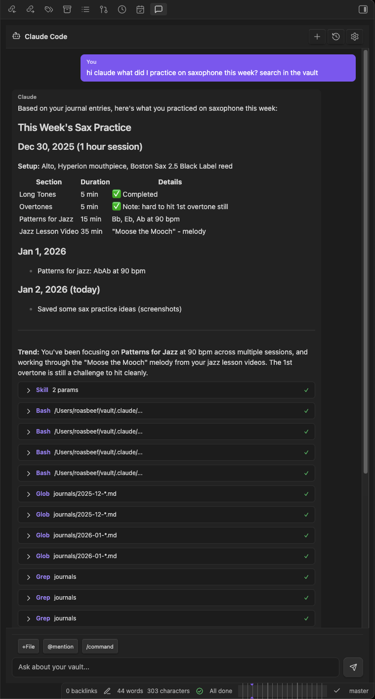
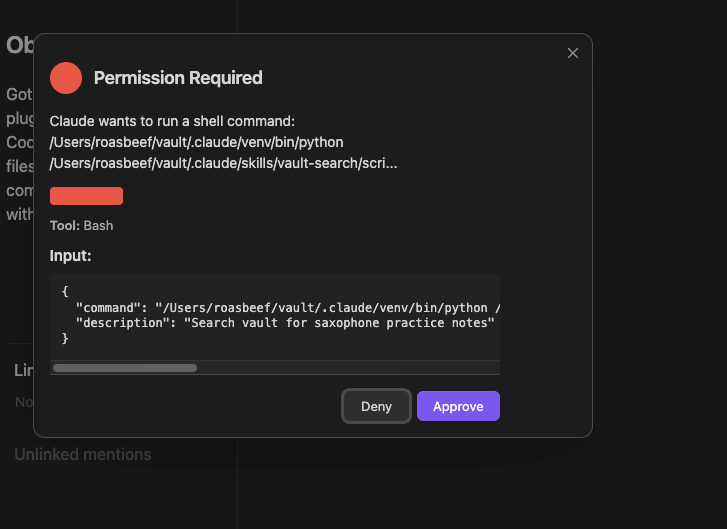
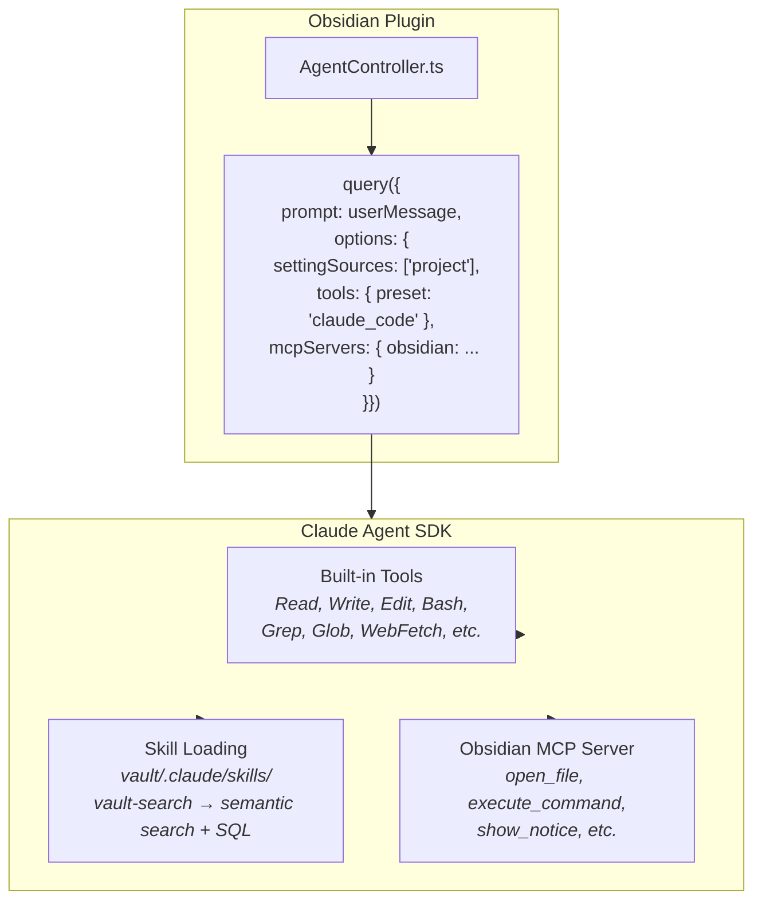

# obsidian-claude-code

A native Obsidian plugin that embeds Claude as an AI assistant directly within your vault. Built on the Claude Agent SDK, the plugin provides a persistent chat sidebar with full access to vault operations through built-in tools, skill loading, and custom Obsidian-specific actions.

## Overview

obsidian-claude-code transforms Obsidian into an AI-augmented knowledge environment. Claude can read, search, and modify your notes while maintaining conversation context across sessions. The implementation uses the Claude Agent SDK with streaming responses, built-in tool presets, and automatic skill loading from your vault's `.claude/skills/` directory.



This is a desktop-only plugin. The Claude Agent SDK requires Node.js runtime, which is available in Obsidian's Electron environment but not on mobile platforms.

## Installation

Clone the repository into your vault's plugin directory:

```bash
cd /path/to/vault/.obsidian/plugins
git clone https://github.com/yourname/obsidian-claude-code
cd obsidian-claude-code
bun install
bun run build
```

Enable the plugin in Obsidian: Settings → Community Plugins → obsidian-claude-code.

For development with hot-reload, symlink the repository:

```bash
ln -s /path/to/obsidian-claude-code /path/to/vault/.obsidian/plugins/obsidian-claude-code
bun run dev  # watches for changes
```

## Configuration

Open Settings → Claude Code to configure:

### Authentication

The plugin supports three authentication methods:

1. **API Key in Settings**: Enter your Anthropic API key directly. Stored in Obsidian's plugin data directory, not synced across devices.

2. **Environment Variable**: Set `ANTHROPIC_API_KEY` in your shell environment.

3. **Claude Max Subscription**: Run `claude setup-token` in your terminal to authenticate with your Claude Pro/Max subscription. This creates a `CLAUDE_CODE_OAUTH_TOKEN` environment variable.

The settings page will show which authentication method is active.

### Model Selection

Choose between:
- `claude-sonnet-4-20250514` for faster responses
- `claude-opus-4-5-20250501` for complex reasoning tasks

### Auto-Approve Settings

By default, read operations are auto-approved while writes require confirmation. Toggle `autoApproveVaultWrites` to skip write confirmations for trusted workflows.

## Usage

Click the chat icon in the ribbon or use `Cmd+Shift+C` to toggle the sidebar. The interface supports:

**Direct Questions**: Ask about vault contents, request summaries, or get help with writing.

**File References**: Use `@[[filename]]` syntax to include specific files in context. The `@mention` button provides autocomplete for vault files.

**Slash Commands**: Type `/` for command autocomplete:
- `/new` starts a fresh conversation
- `/clear` clears history
- `/file` adds the active file to context
- `/search` initiates vault search

**Tool Execution**: Claude can execute tools to interact with your vault. Tool calls appear as collapsible blocks showing the operation and result. Write operations display a permission modal unless auto-approve is enabled.



## Architecture

The plugin uses the Claude Agent SDK's `query()` function with three layers of tool access:



**Agent Layer** (`src/agent/`): `AgentController` orchestrates the SDK query, managing streaming responses and session resumption. `ObsidianMcpServer` defines custom tools for Obsidian-specific actions. `ConversationManager` persists chat history to `.obsidian-claude-code/`.

**View Layer** (`src/views/`): Renders the chat interface. `ChatView` is an Obsidian `ItemView` that hosts message display and input components. Message rendering supports full markdown with syntax highlighting.

See [docs/architecture.md](docs/architecture.md) for detailed component documentation.

## Tool Capabilities

### Built-in Tools (from Claude Agent SDK)

| Tool | Operation |
|------|-----------|
| `Read` | Read file contents |
| `Write` | Create or modify files |
| `Edit` | Edit files in place |
| `Bash` | Execute shell commands |
| `Grep` | Search file contents |
| `Glob` | Find files by pattern |
| `WebFetch` | Fetch web content |
| `WebSearch` | Search the web |

### Obsidian-Specific Tools (SDK MCP Server)

| Tool | Operation |
|------|-----------|
| `open_file` | Open file in Obsidian view |
| `execute_command` | Run Obsidian command |
| `show_notice` | Display notification |
| `get_active_file` | Get current file info |
| `rebuild_vault_index` | Trigger vault-search index rebuild |
| `list_commands` | Discover available commands |
| `create_note` | Create new notes |
| `reveal_in_explorer` | Show in file explorer |
| `get_vault_stats` | Vault statistics |
| `get_recent_files` | Recently modified files |

### Skills (from vault/.claude/skills/)

Skills are automatically loaded if they exist in your vault. The `vault-search` skill provides:
- Semantic search via sqlite-vec embeddings
- SQL queries on note frontmatter (Dataview replacement)
- Index rebuild command

## Data Storage

Conversation data is stored in `.obsidian-claude-code/` at the vault root:

```
.obsidian-claude-code/
├── conversations.json    # Metadata index
└── history/
    └── {id}.json         # Full message history per conversation
```

This directory can be added to `.gitignore` if you don't want to sync conversation history.

## Development

```bash
bun install          # Install dependencies
bun run dev          # Watch mode with rebuild
bun run build        # Production build
bun run tsc -noEmit  # Type check only
```

The build produces `main.js` using esbuild configured for Obsidian's environment. Source maps are included in development builds.

## Requirements

- Obsidian 1.4.0 or later (desktop only)
- Authentication: Anthropic API key or Claude Max subscription
- Optional: `vault-search` skill in `.claude/skills/` for semantic search

## License

MIT
