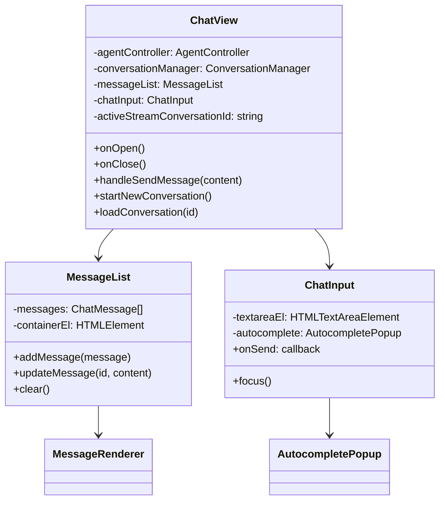

# Architecture

This document describes the internal architecture of obsidian-claude-code, covering component responsibilities, data flow, and key design decisions.

## System Overview

The plugin uses the Claude Agent SDK's `query()` function to bridge Obsidian's workspace with Claude. User messages flow through an agent controller that manages sessions and tool execution, while responses stream back through a view layer that renders markdown and tool call visualizations.


## Component Hierarchy

### ClaudeCodePlugin

The plugin entry point (`src/main.ts`) handles Obsidian lifecycle events. On load, it registers the chat view type, adds ribbon and command palette entries, and initializes the settings tab.

Key responsibilities:
- Register `ChatView` as an `ItemView` type
- Bind keyboard shortcuts (`Cmd+Shift+C` for toggle)
- Persist settings via Obsidian's `loadData`/`saveData`
- Coordinate view lifecycle (create, reveal, detach)
- Check for authentication (API key or env vars)

### ChatView

The primary interface (`src/views/ChatView.ts`) extends Obsidian's `ItemView` to render in the right sidebar. It instantiates the agent controller and conversation manager, wiring them together during initialization. Multiple chat windows can be open simultaneously, each with independent state.



The view decomposes into:
- `MessageList`: Scrollable container for conversation messages
- `MessageRenderer`: Individual message with markdown rendering and tool call display
- `ChatInput`: Textarea with autocomplete for commands and file mentions
- `AutocompletePopup`: Floating suggestion list for `/commands` and `@files`

### AgentController

The SDK orchestrator (`src/agent/AgentController.ts`) manages the Claude Agent SDK query and session state. Each user message triggers a call to `query()`, which handles the entire tool execution loop internally.


The controller uses the SDK's `query()` function with these key options:
- `settingSources: ['project']` - Load CLAUDE.md and skills from vault
- `tools: { preset: 'claude_code' }` - Use all built-in Claude Code tools
- `systemPrompt: { preset: 'claude_code' }` - Use Claude Code's system prompt
- `mcpServers: { obsidian: obsidianMcp }` - Register custom Obsidian tools
- `resume: sessionId` - Resume previous conversation sessions

### ObsidianMcpServer

Custom tool definitions (`src/agent/ObsidianMcpServer.ts`) using the SDK's `createSdkMcpServer()` and `tool()` helpers. These tools are Obsidian-specific and allow Claude to interact with the Obsidian UI.


Each tool is defined with:
- Name and description for Claude
- Zod schema for input validation
- Handler function that returns MCP-compliant results

### ConversationManager

Persistence layer (`src/agent/ConversationManager.ts`) stores conversation metadata and message history. The data model separates a lightweight index from full message payloads.

Key capabilities:
- `addMessage()` - Add message to current conversation
- `addMessageToConversation(id, message)` - Add message to specific conversation by ID (enables background streaming)
- `loadConversation(id)` - Load and switch to a conversation
- `loadConversationById(id)` - Load without switching (for background saves)
- Session ID tracking for SDK resumption


On load, the manager reads the index and can lazily load individual conversation histories. The `sessionId` field stores the SDK session ID for resuming conversations via the SDK's resume feature.

## Tool Architecture

### Three Layers of Tools

The plugin provides tools to Claude through three mechanisms:

```
┌─────────────────────────────────────────────────────────────┐
│  Layer 1: Built-in Tools (from SDK preset)                 │
│  Read, Write, Edit, Bash, Grep, Glob, WebFetch, etc.       │
├─────────────────────────────────────────────────────────────┤
│  Layer 2: Skills (from vault/.claude/skills/)              │
│  vault-search: semantic search + SQL queries               │
├─────────────────────────────────────────────────────────────┤
│  Layer 3: Obsidian MCP Server (ObsidianMcpServer.ts)       │
│  open_file, execute_command, show_notice, etc.             │
└─────────────────────────────────────────────────────────────┘
```

**Layer 1** - Built-in tools are provided by the Claude Agent SDK when using `tools: { preset: 'claude_code' }`. These include all standard file, search, and shell operations.

**Layer 2** - Skills are loaded automatically when `settingSources: ['project']` is set. The SDK scans `vault/.claude/skills/*/SKILL.md` and makes those tools available to Claude.

**Layer 3** - Custom Obsidian tools are defined in `ObsidianMcpServer.ts` using the SDK's MCP server API. These provide Obsidian-specific capabilities that aren't available through the file system.

### Permission Handling

Permissions are handled through the SDK's `canUseTool` callback:


Read-only tools (Read, Glob, Grep, get_active_file, etc.) are auto-approved. Write operations check the `autoApproveVaultWrites` setting. Obsidian UI tools (open_file, execute_command, show_notice) are auto-approved since they don't modify vault content.

## Data Flow

### Message Processing Pipeline


User input is passed directly to the SDK's `query()` function. The SDK handles:
- Building the full prompt with system instructions
- Managing conversation context via session resumption
- Executing tools and feeding results back to Claude
- Streaming response events

The controller processes the SDKMessage stream, extracting content updates and tool call information for the UI.

### Session Resumption

The SDK maintains session state that can be resumed across plugin reloads:


### Background Streaming

When the user switches conversations while Claude is responding, the stream continues in the background rather than being cancelled. This enables smooth multi-tasking without losing partial responses.


Key implementation details:
- `activeStreamConversationId` tracks which conversation owns the running stream
- UI event handlers check this before updating (skip if viewing different conversation)
- `addMessageToConversation(id, message)` saves to specific conversation by ID
- Switching conversations clears UI streaming state but doesn't cancel the actual stream

## Extension Points

### Adding Obsidian Tools

Add new tools to `ObsidianMcpServer.ts` using the SDK's `tool()` helper:

```typescript
tool(
  "my_obsidian_tool",
  "Description of what the tool does",
  {
    param: z.string().describe("Parameter description")
  },
  async (args) => {
    // Access Obsidian APIs via `app`
    const result = await app.vault.read(/* ... */);
    return {
      content: [{ type: "text", text: result }]
    };
  }
)
```

### Adding Skills

Create a skill in `vault/.claude/skills/my-skill/`:

```
vault/.claude/skills/my-skill/
├── SKILL.md           # Skill definition and instructions
└── scripts/
    └── action.py      # Executable scripts
```

Skills are automatically loaded when `settingSources: ['project']` is set.

### Adding Slash Commands

Extend `SLASH_COMMANDS` in `AutocompletePopup.ts` and handle in `ChatInput.handleCommand()`:

```typescript
{
  type: "command",
  value: "/mycommand",
  label: "/mycommand [arg]",
  description: "Command description",
  icon: "icon-name"
}
```
